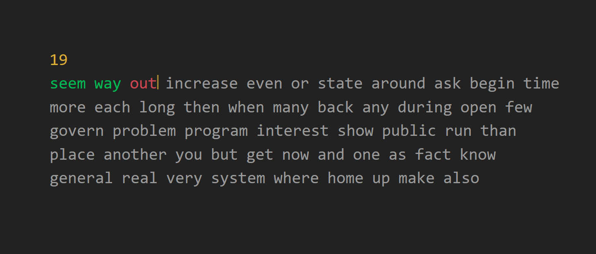

# ⌨️ Typing Speed Test

<p align="center">
  
</p>

<p align="center">
  
  
  
  
  
</p>

<p align="center">
  <a href="https://alobuuls.github.io/typing-speed-test/" target="_blank">
    
  </a>
  <a href="https://github.com/alobuuls/typing-speed-test/stargazers" target="_blank">
    
  </a>
  <a href="https://github.com/alobuuls/typing-speed-test/commits/main" target="_blank">
    
  </a>
</p>

---

🌐 **Play here:** https://alobuuls.github.io/typing-speed-test/

---

## 📖 Description

Typing Speed Test is a browser-based typing game built with vanilla JavaScript.

Players must type randomly generated words as quickly and accurately as possible before the timer reaches zero. At the end of each session, the application generates detailed statistics including typing speed, accuracy, correct words, incorrect words, and corrected mistakes.

---

## ⚙️ System Requirements

Before running the project, make sure you have:

- 🌐 A modern web browser (Chrome, Firefox, Edge, Safari)
- 📦 Git (optional)

---

## 🔍 Verify Installation

Check that Git is installed:

```bash
git --version
```

---

## 🚀 Project Installation

### 1️⃣ Clone the repository

```bash
git clone git@github.com:alobuuls/typing-speed-test.git
cd typing-speed-test
```

### 2️⃣ Open the project

No dependencies or package installation are required.

You can simply open:

```text
index.html
```

or run the project using Live Server in Visual Studio Code.

---

## ▶️ Run the Project

Open the `index.html` file directly in your browser or start a local development server.

---

## 🧠 Project Architecture

The application is built using vanilla JavaScript and direct DOM manipulation.

### 📦 Core Modules

#### Game Engine

Responsible for:

- Initializing the game
- Managing the countdown timer
- Generating random words
- Restarting the game session

#### Typing System

Handles:

- User keyboard input
- Character validation
- Word validation
- Navigation between words

#### Statistics Engine

Calculates:

- Correct words
- Incorrect words
- Corrected words
- Correct characters
- Incorrect characters
- Corrected characters
- Accuracy percentage
- Words Per Minute (WPM)

---

## ✨ Features

- ⌨️ Real-time typing test
- ⏱️ 30-second countdown timer
- 🎯 Character-by-character validation
- 📊 Automatic WPM calculation
- 📈 Accuracy percentage calculation
- ✅ Correct word tracking
- ❌ Incorrect word tracking
- 🔄 Corrected error detection
- 🎲 Random word generation
- 📋 Detailed performance statistics
- 🔁 One-click restart functionality

---

## 🕹️ Controls

| Key           | Action              |
| ------------- | ------------------- |
| Any key       | Start the game      |
| Letters       | Type words          |
| Space         | Submit current word |
| Backspace     | Correct mistakes    |
| Reload Button | Restart game        |

---

## 🛠 Technologies Used

- HTML5
- CSS3
- JavaScript (ES6+)
- DOM API

---

## 📁 Project Structure

```text
typing-speed-test/
├── index.html
├── styles.css
├── main.js
├── images/
│   └── preview.png
└── README.md
```

---

## 🔥 Best Practices Implemented

- Separation of responsibilities
- Efficient DOM manipulation
- Event-driven architecture
- Reusable functions
- Real-time validation logic
- State management through JavaScript
- Clear and maintainable code structure

---

## 🎯 Project Goal

Practice and strengthen fundamental JavaScript concepts through an interactive application:

- DOM manipulation
- Keyboard events
- State management
- Real-time data processing
- Performance metrics calculation
- User interaction handling
- Application architecture without frameworks

---

## 📄 License

This project is intended for educational purposes and is part of a personal portfolio.
